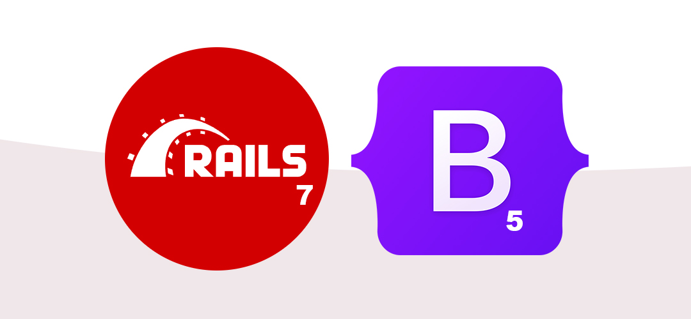
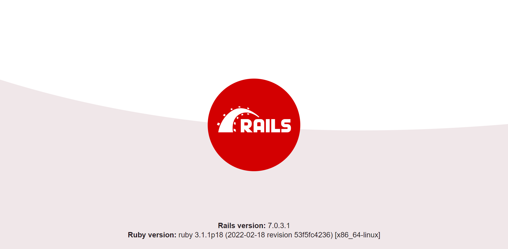
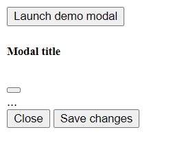
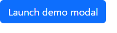
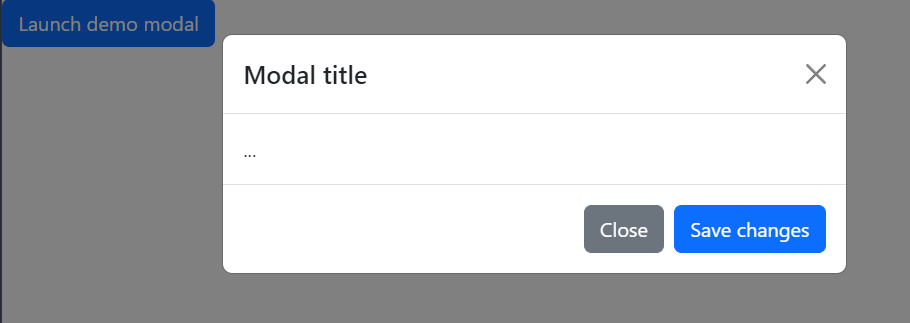

# How to Create a Rails 7 App with Bootstrap and Import Maps



Ruby on Rails' popularity can probably be attributed to the first pillar of [The Rails Doctrine](https://rubyonrails.org/doctrine):
> Optimize for programmer happiness

True to form, Rails 7 brings with it a new era in the ease and simplicity of handling JavaScript modules - complicated bundling and transpiling is now purely optional. Add to this, the ability to create new apps with prebuilt CSS frameworks like Bootstrap, and it's easy to get excited about getting stuck in to a new Rails app.

But with several different options on setting up JavaScript and Bootstrap in your new app, you may be left a little unsure of the best setup to go with.

By the time we're finished here, we'll have set up a fresh Rails 7 app, with Bootstrap 5 integrated. All with the ability to take advantage of the simplicity of JavaScript with import maps.

## Rails 7 and Import Maps
Rails is an ever evolving beast - with each new iteration comes the latest ideas on how to make devs' lives a little bit easier. When Rails 5.1 was let loose on the world, Webpacker was introduced as a way of bundling JavaScript assets, in a way that worked for browsers of the time. Many years on, we have now seen huge advances in HTTP/2 and ES6 JavaScript support - suddenly, the complexity of Webpacker has become mostly unnecessary. 

Enter [import maps](https://github.com/WICG/import-maps), the new default Rails solution to JavaScript modules. With the help of import maps, it is incredibly easy to import JavaScript modules without the need for bundling or transpiling. DHH (the creator of Ruby on Rails) does an incredible job of explaining the introduction of import maps into Rails, [here](https://world.hey.com/dhh/modern-web-apps-without-javascript-bundling-or-transpiling-a20f2755).


## Should you use the new `rails new --css` option?
Another new addition in Rails 7 is the `--css` flag that can be used with `rails new`. With this new option, you can start your app off with any of the following CSS setups:
- Tailwind
- Bootstrap
- Bulma
- PostCSS
- Sass

The answer to the question, *"should you use the `--css` flag?"* probably seems like a no-brainer. The answer is however, *"it depends"*.

Setting up a Rails 7 app with `--css=bootstrap` installs esbuild, bringing with it bundling, package management, and nullifying import maps. So if you want to take advantage of the simplicity of import maps, taking the two minutes to set up Bootstrap, without the `--css` flag, is definitely worth it.


## Prerequisites
There are a couple of things we're going to need in place before we can begin:
- Ruby 2.7.0+ required, Ruby 3.0+ preferred
- Rails 7.0.0+ required

Funnily enough, Rails 7 is non-negotiable when creating a Rails 7 app. Ruby 3, on the other hand, is not *completely* necessary, however setting up a fresh app is always the perfect opportunity to make sure all of your technology is up-to-date.

There are several options for [installing Ruby](https://www.ruby-lang.org/en/documentation/installation/). If you plan on using Ruby for the forseeable future, or if you plan on creating multiple projects, do yourself a favour and use a version manager ([rbenv](https://github.com/rbenv/rbenv) is a popular, lightweight option).

Once Ruby is set up, setting up Rails should be no problem. Follow the steps in section [3.1 Installing Rails](https://guides.rubyonrails.org/getting_started.html#creating-a-new-rails-project-installing-rails) on Rails Guides.

With that out of the way, it's time to get started.

## Let's get started
By the end of this section, we'll have:
- a fresh Rails 7 app
- Bootstrap 5 installed
- tested Bootstrap's CSS and JavaScript
- import maps ready to handle our imported JavaScript modules

Open up a terminal in the directory you want your app to sit in and follow along.

### Create a rails app
As we saw before, in order to set up a new Rails 7 app, with the shiny new `importmaps-rails` features, we will need to create the app without the new `--css=bootstrap` option - run:
```bash
rails new example_app
```
For all of the following setup, we're going to want to be working from the new app directory by running:
```bash
cd example_app
```
Rails won't be happy without a database set up, so let's get that out of the way now by running:
```bash
rails db:create
```
Now we can check to see if our rails app is correctly set up. Start a rails server by running: 
```bash
rails s
```
Then open the returned link `http://127.0.0.1:3000` in the browser:
```
=> Booting Puma
=> Rails 7.0.3.1 application starting in development  
=> Run `bin/rails server --help` for more startup options
Puma starting in single mode...
* Puma version: 5.6.4 (ruby 3.1.1-p18) ("Birdie's Version")
*  Min threads: 5
*  Max threads: 5
*  Environment: development*          PID: 5894       
* Listening on http://127.0.0.1:3000
* Listening on http://[::1]:3000
Use Ctrl-C to stop
```
If you see the Rails 7 placeholder page, congratulations, you have a working app.



If you're not seeing it, something along the way so far has gone wrong.

### Creating a Bootstrap test page
For seasoned Rails 7 Bootstrap veterans, setting up a test view probably isn't necessary. Still, taking a minute to set one up can be incredibly handy.

First of all, we need to re-route the root path to the test page we are about to set up. Open up `config/routes.rb` and uncomment the following line:
```ruby
# root "articles#index"
```
This line tells rails that when someone visits the `root` path, it should look for the `articles` controller and, within that, look for the `index` action.

Now, we haven't set up any controllers yet and as we're just creating a quick test view, we can just hijack the default `ApplicationController`. Change the root path:
```ruby
root "application#bootstrap_test"
```
Create a new `app/views/application/` directory and add a new file `bootstrap_test.html.erb`. When we refresh the page in the browser, this is the file that we will see.

In this file, we're going to add a bootstrap template with some kind of JavaScript action. You can grab anything you like from the [Bootstrap docs](https://getbootstrap.com/docs/5.0/), or you can use this modal example template:
```html
<!-- Button trigger modal -->
<button type="button" class="btn btn-primary" data-bs-toggle="modal" data-bs-target="#exampleModal">
  Launch demo modal
</button>

<!-- Modal -->
<div class="modal fade" id="exampleModal" tabindex="-1" aria-labelledby="exampleModalLabel" aria-hidden="true">
  <div class="modal-dialog">
    <div class="modal-content">
      <div class="modal-header">
        <h5 class="modal-title" id="exampleModalLabel">Modal title</h5>
        <button type="button" class="btn-close" data-bs-dismiss="modal" aria-label="Close"></button>
      </div>
      <div class="modal-body">
        ...
      </div>
      <div class="modal-footer">
        <button type="button" class="btn btn-secondary" data-bs-dismiss="modal">Close</button>
        <button type="button" class="btn btn-primary">Save changes</button>
      </div>
    </div>
  </div>
</div>
```
Upon refreshing the browser, you should see this ugly, scriptless monstrosity. 



You'll notice there is no styling and none of the buttons do anything, but this is where we will see progress happen.

### Setting up Bootstrap CSS
For those of you who have used bootstrap in earlier versions of Rails, this part will be pretty familiar.
Let's add the Bootstrap gem to our app by running:
```bash
bundle add bootstrap
```
This does two things:
- adds `gem "bootstrap"` to our `Gemfile`
- uses `bundler` to add the gem to our app

Whenever you change your `Gemfile`, you need to restart your server, so let's stop the rails server `Ctrl+C` and restart it `rails s`.

As bootstrap uses Sass, we need to rename the `app/assets/stylesheets/application.css` file as `app/assets/stylesheets/application.scss`.

Then add the following line:
```scss
@import "bootstrap";
```
To see how this styling is loaded into the browser, open up the file `app/views/layouts/application.html.erb` and we'll see the following line:
```h
    <%= stylesheet_link_tag "application", "data-turbo-track": "reload" %>
```
Refreshing the browser will now show us our first bit of working bootstrap.



If you can see those smooth curves and that friendly Bootstrap blue, then you've successfully set up the CSS portion of Bootstrap.

### Setting up Bootstrap JavaScript
When you saw that button, you may have enthusiastically clicked on it, only to be filled with instant disappointment. Well don't worry, this is where the magic of import maps comes in.

As import maps is now the go to way of importing JavaScript modules (as long as we didn't use the `--css=bootstrap` option), import maps should already be completely set up. If it is, we should see the following three things:
- `config/importmap.rb` - this is where import maps, maps specifiers to their corresponding CDN links
- an import maps comment in `app/javascript/application.js` - this is where we import the modules for use in our JavaScript files
- similar to how our styling is imported, you will find the following line in `app/views/layouts/application.html.erb`:
```h
<%= javascript_importmap_tags %>
```
Now we know that import maps is correctly installed, we can use it to add the Bootstrap JavaScript CDN by running:
```bash
bin/importmap pin bootstrap
```
Check the following two lines have been added to `config/importmap.rb`:
```ruby
pin "bootstrap", to: "https://ga.jspm.io/npm:bootstrap@5.2.0/dist/js/bootstrap.esm.js"
pin "@popperjs/core", to: "https://ga.jspm.io/npm:@popperjs/core@2.11.5/lib/index.js"
```
Then add the following line to `app/javascript/application.js`:
```js
import "bootstrap"
```
Now when we refresh our browser, we should be able to click on the modal button and see the following:



If you can open and close the modal, throw some celebratory finger guns, you've successfully set up Bootstrap in Rails 7.

### Getting our app ready for development
You're probably raring to go, but it's a good idea to get rid of those redundant test files and code:
- Delete the `app/views/application/` directory, as well as its file `bootstrap_test.html.erb`
- Open the `config/routes.rb` file and comment out the following line:
```ruby
root "application#bootstrap_test"
```
## Conclusion
With that famous Rails magic and a little bit of help from the new import maps, setting up a Rails 7 app with Bootstrap can be quite a straightforward process. Give it a few goes and you'll be setting up in less than five minutes.
